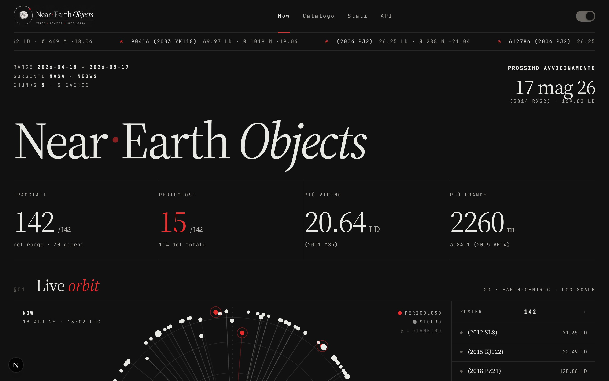
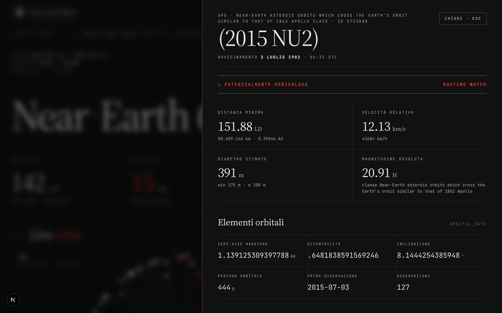

# Arkemis NEO Dashboard

<p align="center">
  <strong>Una dashboard full-stack per leggere, filtrare e raccontare i Near Earth Objects della NASA</strong><br/>
  con <code>Next.js</code>, <code>FastAPI</code>, <code>ECharts</code> e un proxy che protegge la chiave NASA.
</p>

<p align="center">
  
  
  
  
  
  
  
</p>

<p align="center">
  <a href="#il-progetto">Il progetto</a> ·
  <a href="#quick-start">Quick Start</a> ·
  <a href="#api-implementate">API</a> ·
  <a href="#scelte-tecniche">Scelte tecniche</a> ·
  <a href="#deploy">Deploy</a>
</p>

---

## Quick Cards

<table>
  <tr>
    <td width="25%">
      <h3>🚀 Quick Start</h3>
      <p>Avvio locale di frontend e backend, variabili ambiente e check rapidi.</p>
      <p><a href="#quick-start">Vai alla sezione</a></p>
    </td>
    <td width="25%">
      <h3>🛰️ Architettura</h3>
      <p>Monorepo con <code>frontend/</code>, <code>backend/</code>, cache file-based e contratti API chiari.</p>
      <p><a href="#struttura">Apri la struttura</a></p>
    </td>
    <td width="25%">
      <h3>📡 API</h3>
      <p>Feed con chunking oltre 7 giorni, dettaglio NEO, health, metrics, invalidazione cache.</p>
      <p><a href="#api-implementate">Vedi gli endpoint</a></p>
    </td>
    <td width="25%">
      <h3>🌍 Deploy</h3>
      <p>Setup consigliato con Vercel + Render/Railway/Fly.io e nota su GitHub Pages.</p>
      <p><a href="#deploy">Apri la guida</a></p>
    </td>
  </tr>
</table>

## Il progetto

Arkemis NEO Dashboard nasce come risposta alla challenge [arkemis.it/challenges/nasa-neo](https://arkemis.it/challenges/nasa-neo): prendere i dati grezzi di **NASA NeoWs** e trasformarli in un'esperienza leggibile, filtrabile e visivamente forte. Il browser non tocca mai direttamente `api.nasa.gov`: parla solo con il backend FastAPI, che fa da proxy, spezza i range lunghi, mette in cache le risposte e restituisce al frontend un payload già pronto per lista, grafici e schede dettaglio.

### Cosa rende il progetto utile
- evita di esporre `NASA_API_KEY` nel browser
- gestisce automaticamente il limite NASA dei 7 giorni per chiamata
- riusa i chunk già scaricati grazie alla cache file-based
- offre una UI con stati di loading, errore ed empty robusti
- mantiene il feeling editoriale del mock `arkemis/`


_Figura 01 — piccola ricostruzione delle orbite di due asteroidi nel mese di maggio._

## Screenshots

<table>
  <tr>
    <td align="center"></td>
  </tr>
  <tr>
    <td align="center"><sub>La dashboard principale: orbite Earth-centric, lista filtrabile, distribuzione dimensioni.</sub></td>
  </tr>
  <tr>
    <td align="center"></td>
  </tr>
  <tr>
    <td align="center"><sub>La pagina <code>/neo/[id]</code>: orbita evidenziata, prossimi avvicinamenti e dati orbitali.</sub></td>
  </tr>
</table>

## Struttura

```text
NASA NEO/
├── frontend/        # Next.js 15 + TypeScript + ECharts + canvas 2D
├── backend/         # FastAPI + httpx + cache file-based + Prometheus
│   └── BACKEND_DECISIONS.md   # memoria operativa post-review
├── docs/            # guide e doc pubblica delle scelte
│   ├── design-choices.md
│   ├── architecture.md
│   ├── api.md
│   ├── features.md
│   ├── deployment-guide.md
│   └── neo-data-display-ideas.md
├── wiki/            # vault Obsidian con note di sviluppo (graph view)
├── assets/          # logo + screenshot del README
├── arkemis/         # handoff bundle del design, solo reference
├── .env.example
└── README.md
```

## Cosa fa

<table>
  <tr>
    <td width="50%">
      <h3>Backend intelligente</h3>
      <ul>
        <li>proxy unico verso NASA NeoWs</li>
        <li>chunking automatico oltre 7 giorni</li>
        <li>cache feed e dettaglio NEO con TTL distinti</li>
        <li>retry con jitter, rispetto di <code>Retry-After</code></li>
        <li>mapping errori dominio → HTTP + metriche Prometheus</li>
      </ul>
    </td>
    <td width="50%">
      <h3>Frontend orientato all'esplorazione</h3>
      <ul>
        <li>vista orbitale Earth-centric (canvas 2D, scala log)</li>
        <li>filtri per pericolo + sort per data/distanza/dimensione/velocità</li>
        <li>grafici ECharts (scatter distanza/tempo, istogramma dimensioni)</li>
        <li>pannello dettaglio + pagina standalone <code>/neo/[id]</code></li>
        <li>tema dark/light sincronizzato con i chart</li>
      </ul>
    </td>
  </tr>
</table>

## Quick Start

### Prerequisiti
- Node.js 20+ consigliato
- Python 3.9+
- una chiave NASA da [api.nasa.gov](https://api.nasa.gov/) (gratuita)

### Variabili ambiente

```bash
cp .env.example .env
```

Poi apri `.env` e inserisci la tua chiave:

```env
NASA_API_KEY=replace-with-your-nasa-api-key
NEXT_PUBLIC_API_BASE_URL=http://127.0.0.1:8000
```

Tutte le variabili sono documentate in [backend/app/core/config.py](backend/app/core/config.py). Quelle interessanti per il deploy: `ALLOWED_ORIGINS`, `ALLOWED_ORIGIN_REGEX`, `CACHE_DIR`, `FEED_TTL_SECONDS`, `NEO_TTL_SECONDS`, `UPSTREAM_CONCURRENCY`, `ENABLE_ADMIN_ENDPOINTS`.

### Avvio backend

```bash
cd backend
python3 -m venv .venv
source .venv/bin/activate
pip install -r requirements.txt
uvicorn app.main:app --reload
```

### Avvio frontend

```bash
cd frontend
npm install
npm run dev
```

### URL locali
- Frontend: [http://localhost:3000](http://localhost:3000)
- Backend: [http://127.0.0.1:8000](http://127.0.0.1:8000)
- OpenAPI Swagger: [http://127.0.0.1:8000/docs](http://127.0.0.1:8000/docs)

## API implementate

Tutti gli endpoint reali esposti da [backend/app/main.py](backend/app/main.py).

| Metodo | Endpoint | Descrizione | Note |
|---|---|---|---|
| `GET` | `/` | Liveness minimale (nome app + status) | |
| `GET` | `/api/feed` | Feed flatten con chunking ≤ 7gg e cache | Query: `start_date`, `end_date` ISO. Definito in [routes_feed.py](backend/app/api/routes_feed.py) |
| `GET` | `/api/neo/{neo_id}` | Dettaglio singolo asteroide | `neo_id` solo numerico (`^[0-9]+$`). [routes_neo.py](backend/app/api/routes_neo.py) |
| `GET` | `/api/health` | Stato cache + ultimo upstream NASA | Versione "ufficiale" in schema. [routes_health.py](backend/app/api/routes_health.py) |
| `GET` | `/health` | Alias per probe esterni | Out-of-schema, stessa risposta di `/api/health` |
| `GET` | `/metrics` | Esposizione Prometheus | Out-of-schema. [routes_metrics.py](backend/app/api/routes_metrics.py) |
| `POST` | `/api/cache/invalidate` | Invalidazione cache per scope (`feed` / `neo`) | Esiste **solo** se `ENABLE_ADMIN_ENDPOINTS=1`. [routes_cache.py](backend/app/api/routes_cache.py) |

Schema completo dei payload in [docs/api.md](docs/api.md) o esplorabile via [http://127.0.0.1:8000/docs](http://127.0.0.1:8000/docs) quando il backend è in piedi.

## Scelte tecniche

Le decisioni più rilevanti, raccontate in sintesi. La storia completa con motivazioni, stato post-review e tabelle dei diff è in **[docs/design-choices.md](docs/design-choices.md)** (e in [backend/BACKEND_DECISIONS.md](backend/BACKEND_DECISIONS.md) per la "memoria operativa" del refactor backend).

- **Proxy unico verso NASA, mai dal browser.** Solo il backend FastAPI parla con NeoWs. La `NASA_API_KEY` non viaggia mai sul client, e questo abilita cache e retry centralizzati. → [docs/design-choices.md](docs/design-choices.md)

- **Chunking automatico ≤ 7 giorni con `chunk_days - 1` end-inclusive.** NeoWs accetta al massimo 7 giorni per chiamata: il backend spezza il range e lancia i chunk in parallelo. L'invariante è nel tipo (`Field(7, ge=1, le=7)`), non solo nei commenti. → [backend/app/utils/dates.py](backend/app/utils/dates.py), [backend/app/core/config.py](backend/app/core/config.py)

- **Cache file-based JSON con TTL distinti.** Feed: 12h, dettaglio NEO: 72h. Zero infra esterna, write atomico con `os.replace`, lock per-(namespace, key) con LRU bounded a 1024 per evitare memory leak. → [backend/app/services/cache_service.py](backend/app/services/cache_service.py)

- **Retry con jitter, rispetto di `Retry-After`.** 3 tentativi, backoff esponenziale `0.4s · 2^attempt` + jitter, retry su 5xx e timeout. Su 429: retry solo se `Retry-After` ≤ 5s, altrimenti fail-fast con `retry_after_seconds` esposto al client. → [backend/app/services/nasa_client.py](backend/app/services/nasa_client.py)

- **Endpoint admin via feature flag, non via auth.** `POST /api/cache/invalidate` esiste solo se `ENABLE_ADMIN_ENDPOINTS=1`. In produzione l'endpoint è invisibile — non risponde 401/403, semplicemente non esiste. → [backend/app/main.py](backend/app/main.py)

- **Metriche Prometheus con label `path` templated.** Middleware ASGI puro che legge `scope["route"]` dopo il dispatch, così la label è `/api/neo/{neo_id}` e non l'id concreto (niente cardinality explosion). → [backend/app/observability.py](backend/app/observability.py)

- **Frontend: una sola SPA con state machine interna.** Le quattro pagine (`now`, `catalog`, `states`, `settings`) vivono come `page` state in `DashboardClient`, senza passare dal router Next. La pagina deep-link `/neo/[id]` riusa lo stesso componente. → [frontend/components/dashboard-client.tsx](frontend/components/dashboard-client.tsx)

- **Vista orbitale a mano, chart standard via ECharts.** Scatter distanza/tempo e istogramma dimensioni sono ECharts. La vista orbitale Earth-centric è canvas 2D nativo con `requestAnimationFrame`, scala log 0.3–80 LD, hit detection a pixel. Mix giusto tra "libreria batterie incluse" e "controllo totale". → [docs/design-choices.md](docs/design-choices.md)

> Vuoi vedere tutte le 24 scelte con motivazioni, stato post-review e link al codice? → **[docs/design-choices.md](docs/design-choices.md)**

## Verifica

### Backend

```bash
cd backend
pytest
```

### Frontend

```bash
cd frontend
npm run typecheck
npm run build
```

### Smoke test rapidi

```bash
curl http://127.0.0.1:8000/api/health | jq
curl "http://127.0.0.1:8000/api/feed?start_date=2026-05-01&end_date=2026-05-07" | jq '.element_count'
```

## Deploy

### Configurazione consigliata
- frontend su **Vercel**
- backend su **Render**, **Railway** o **Fly.io**

### Nota importante
**GitHub Pages da sola non basta**: ospita solo asset statici, quindi non può fare proxy verso NASA, chunking, cache e normalizzazione. Il backend serve, per davvero.

Guida completa, env var richieste e checklist in [docs/deployment-guide.md](docs/deployment-guide.md).

## Documentazione estesa

<table>
  <tr>
    <td width="50%">
      <h3>📐 Scelte di design</h3>
      <p>Tutte le decisioni (24, tra backend e frontend) con motivazione, file di riferimento e stato post-review.</p>
      <p><a href="docs/design-choices.md">Apri docs/design-choices.md</a></p>
    </td>
    <td width="50%">
      <h3>🏗️ Architettura</h3>
      <p>Diagramma end-to-end, flusso di una richiesta feed dal browser fino a NASA e ritorno.</p>
      <p><a href="docs/architecture.md">Apri docs/architecture.md</a></p>
    </td>
  </tr>
  <tr>
    <td width="50%">
      <h3>📘 API reference</h3>
      <p>Schemi dei payload, codici errore e esempi di chiamata.</p>
      <p><a href="docs/api.md">Apri docs/api.md</a></p>
    </td>
    <td width="50%">
      <h3>✨ Features</h3>
      <p>Cosa fa la UI, sezione per sezione: filtri, scrubber, dettaglio, stati edge.</p>
      <p><a href="docs/features.md">Apri docs/features.md</a></p>
    </td>
  </tr>
  <tr>
    <td width="50%">
      <h3>💡 Idee dati e visualizzazioni</h3>
      <p>Cosa è ancora possibile mostrare a partire da NeoWs, JPL e CNEOS.</p>
      <p><a href="docs/neo-data-display-ideas.md">Apri docs/neo-data-display-ideas.md</a></p>
    </td>
    <td width="50%">
      <h3>🧭 Guida alla pubblicazione</h3>
      <p>Scelte hosting, variabili ambiente, limiti di GitHub Pages e setup consigliato.</p>
      <p><a href="docs/deployment-guide.md">Apri docs/deployment-guide.md</a></p>
    </td>
  </tr>
  <tr>
    <td colspan="2">
      <h3>📚 Wiki (Obsidian vault)</h3>
      <p>Note di sviluppo organizzate come knowledge graph. Apri <a href="wiki/"><code>wiki/</code></a> in Obsidian per la graph view, oppure parti dall'<a href="wiki/index.md">indice</a>.</p>
    </td>
  </tr>
</table>

---

<p align="center">
  <em>Il mock vive in <code>arkemis/</code>. L'app reale vive in <code>frontend/</code> e <code>backend/</code>.</em>
</p>
